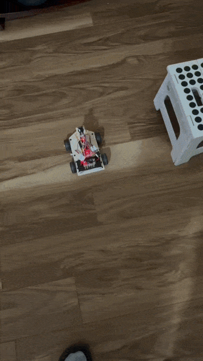
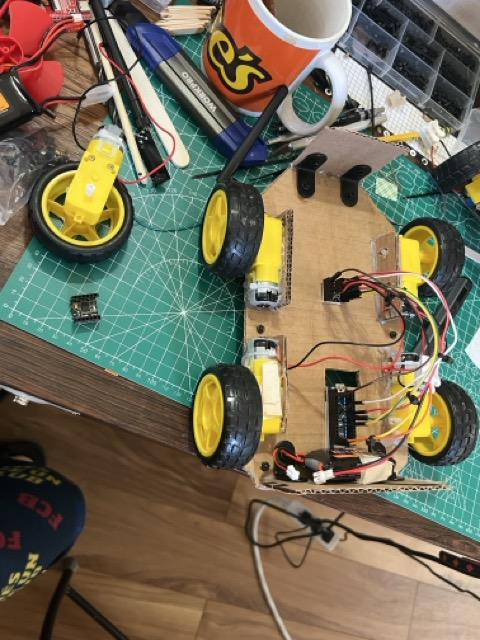
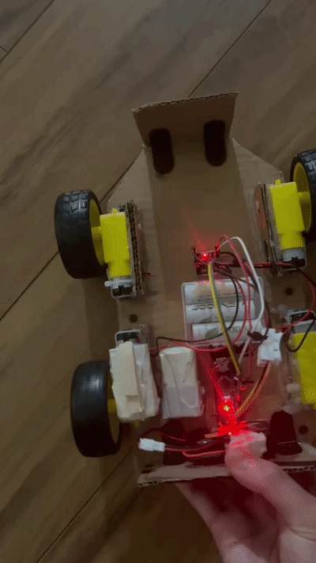
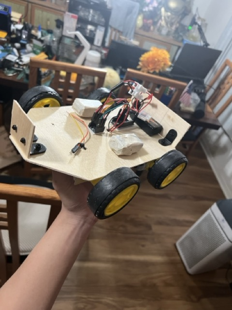
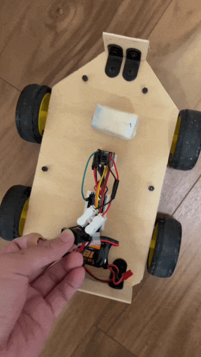
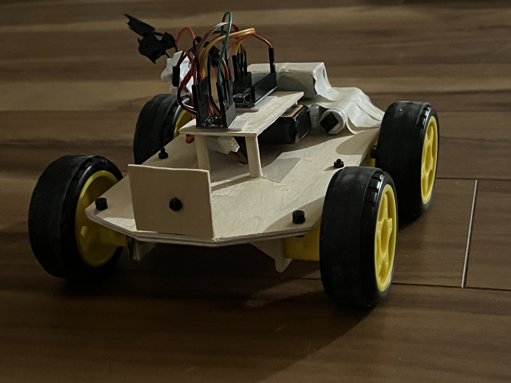
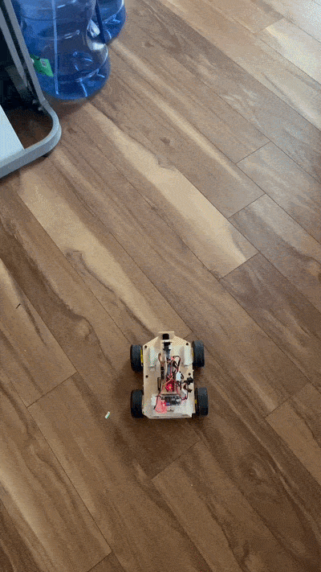
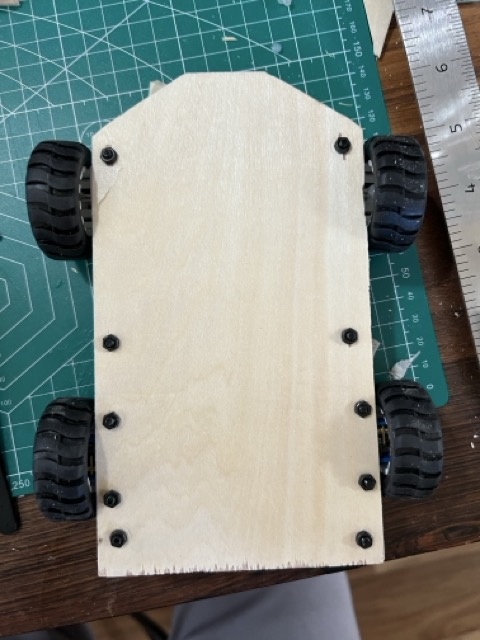
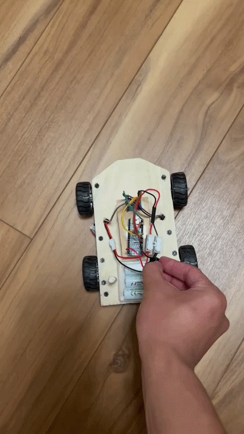

# Obstacle-Avoidance-Rover

## Brief Overview
4WD robot made with a plywood chassis that uses a ToF sensor mounted on a servo that can turn left, right, or 180 using differential drive

## Finished Project

## Project Goals
- Design a 4WD robot that performs basic obstacle avoidance
- Use a ToF sensor to judge distance mounted on a servo to perform basic "scanning"
- Design the chassis out of stiff ploywood instead of flimsy cardboard
- Learn how to measure and fabricate by hand before CAD and 3D printing

## Mechanical Components
- 3mm plywood sheets
- General SuperGlue
- Motor screw mounts
- 3mm steel rods
- M3 screws
- Wooden dowels
- Mounting tape

## Electronics
- Arduino Nano
- DRV8833 Driver module
- Buck Converter
- 7.4 LiPo 2s 35C
- Hobby Gearbox DC motor
- N20 MetalGearbox motors

## Software
- Arduino IDE

## How Does It Work?
Robot constantly takes readings from the ToF sensor to detect whether there is an obstacle in front of it (a set threshold). The robot comes to a halt and scans, starting from the left, and will turn if it has found a path. If there is no path, the robot will reverse and do a 180.

## Timeline/Milestones

1. Designed first cardboard prototype
   > - Good for gauging rough dimensions
   > - Was difficult to maintain consistent contact between the wheels and floor
   > - Cardboard was too flimsy, offset was noticeable
   > - A lot of hot glue 
   > - As a result, the car could not go straight or turn properly
   > - Added some weight for more traction
   > - 4 gearbox motors, 2 of them are drived

     

----------------------------------

2. Prototype #2 (plywood chassis)
   > - First prototype to feature a plywood chassis carved from 3mm plywood sheets
   > - Less hot glue and used super glue for less of a mess and stronger bonding
   > - Added plywood supports at the bottom for more precise mounting
   > - Better alignment but there was still a tiny offset
   > - More consistent in going straight but struggled turning
   > - Was rather wide and bulky
   > - Added Rubber Rings to the wheels for more friction

   . 

----------------------------------

3. Prototype #3
   > - Base dimensions a little smaller
   > -  More precise fabrication gave more consistent results
   > -  Adjusted code so it made more turns in steps and saw more consistent results, may have something to do with less accumulated friction.
   > -  Installed a little tower with a small platform raised with wooden dowels (superglued), the servo is screw mounted on the small platform for basic testing
   > -  Added some weight towards the back. This would put more traction towards the back driver motors for cleaning turns
   

----------------------------------

4. Prototype #4

   > - Base dimensions even smaller
   > - Swapped from yellow gearbox hobby dc motors to N20 metal gearbox motors for more torque
   > - New wheels had better friction and traction with the ground, rings were not needed
   > - Screw mounted the N20 and added a 3mm steel rod to serve as a front dead axle to mount 2 front wheels.
   > - Able to perform a clean 180 turn

. _medium.jpeg)

----------------------------------
5. Code for Obstacle avoidance (Finish)
   > - Rover goes straight until ToF sensor detects something is in front (function called in loop)
   > - Function calls servo_scan function, if no path, return and scan the other direction. If both directions have no available path, call turn_around function.

----------------------------------

  
